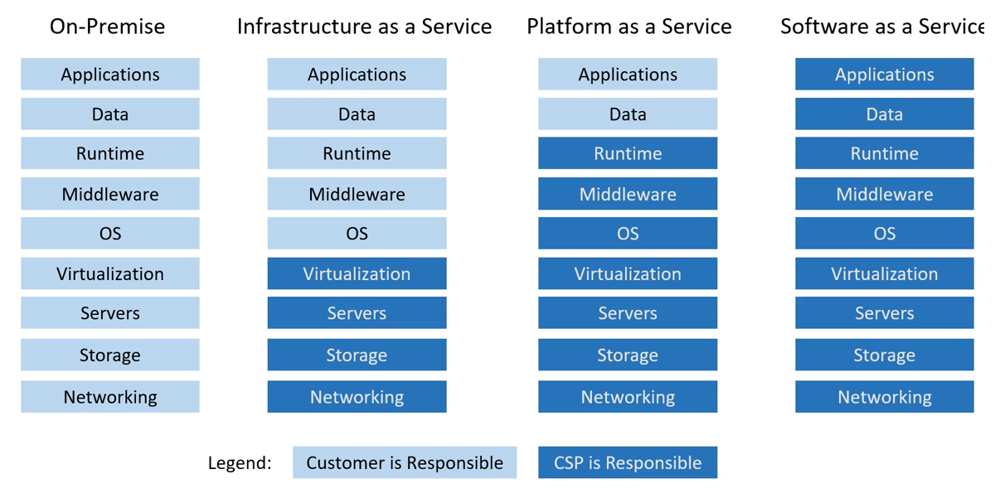
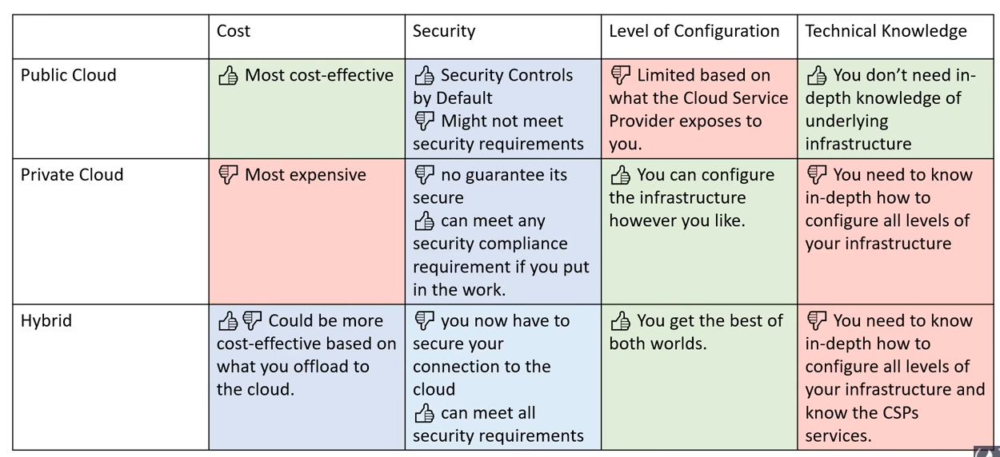
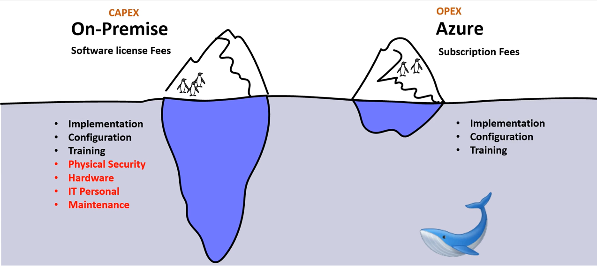
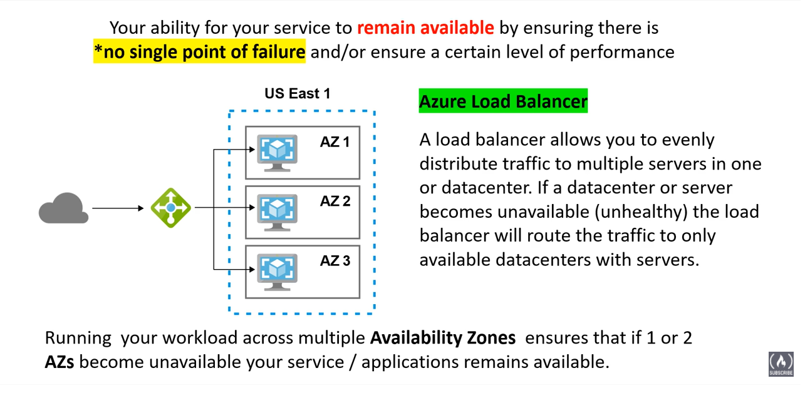
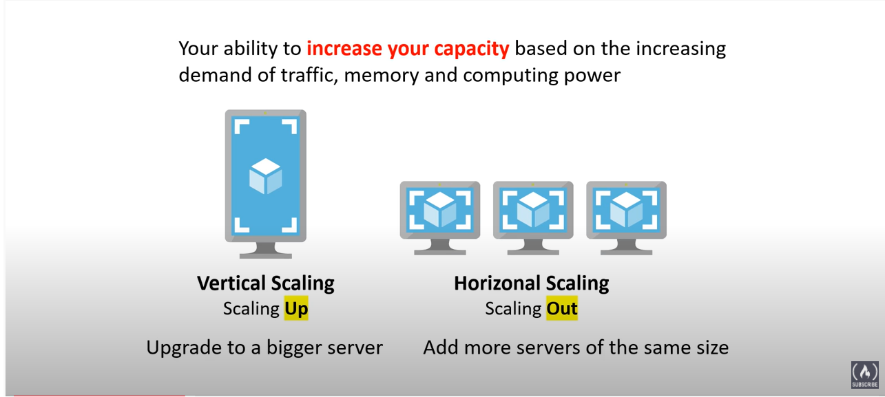
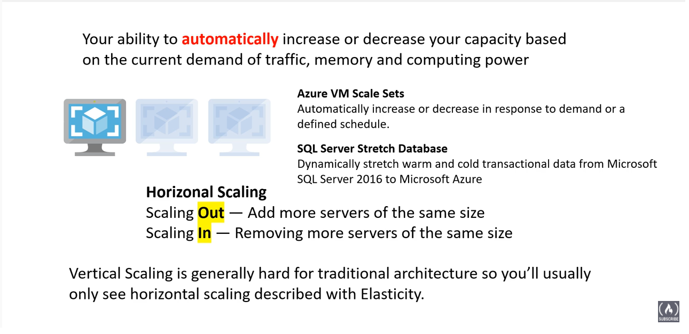
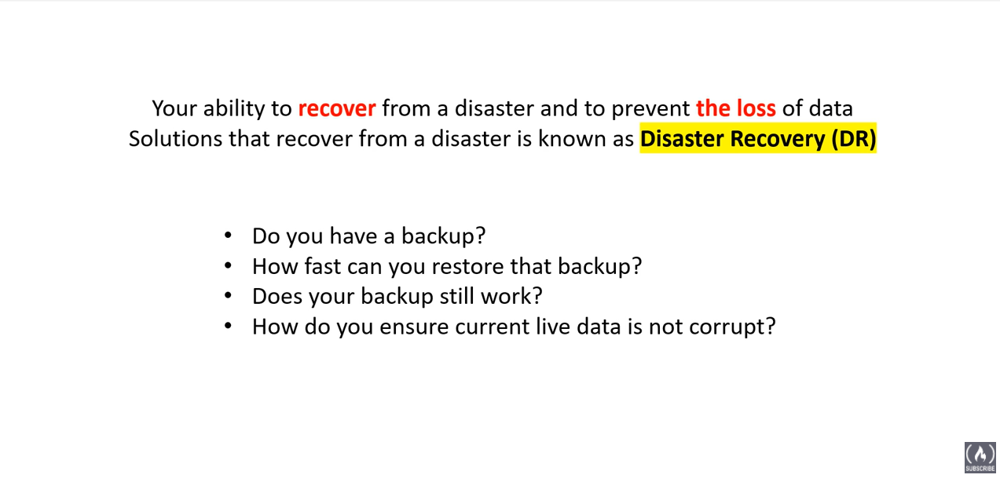

# az-900
Study material for Az-900

# Cloud Computing
Usage of remote servers hosted on the internet for processing, storage, networking etc. for an application.

## On-premise
1. You are responsible for the services, IT people, real estate, risk etc.

## Cloud solution
1. Servers, IT people, real estate are taken care of by someone else.
2. You are responsible for configuration and code.

## Evolution
Dedicated server > Virtual Private Server > Shared Hosting > Cloud Hosting

## Common cloud services for IaaS
1.Compute
2.Storage
3.Networking
4.Databases

## Benefits
1.Cost-effective - No upfront cost. You pay-as-you-go.
2.Global - Anywhere in the world in the form of regions.
3.Secure - Secure by default, using principle of least privilege.
4.Reliable - back up, disaster recovery, fault tolerant and data replication.
5.Elastic - Auto scale up and scale down as per demand.
6.Current - Software patches.

## Types of cloud computing
1.Saas - Product is run and managed by service provider. Ex: Gmail, Office 365.
2.PaaS - Focus on deployment and management of your application. Ex: Heroku, Elastic Beanstalk, Google App Engine.
3.IaaS - Basic building block of cloud IT. Provides access to N/w, compute and storage.

## Responsibilities

## Azure Deployment Models:

## Total Cost of Ownership ( TCO )

## Capex vs Opex
Spending money ###upfront### on physical infrastructure
1. Server costs, harddrives, Routers, cables, switches.
2. Technical Personal
3. Datacenter costs ( Rent, cooling, phyisical security ).

With cloud, Capex is removed. With Operation Expenses, you can try a product or service without investing in equipment.

## Cloud Architecture Terminologies
Availability zone is the Azure Data Center.

1. Availability - ensure that a service remains available.

2. Scalable - Grow rapidly

3. Elasticity - shrink or grow to meet a demand

4. Fault Tolerant - ability to prevent a failure

5. Disaster recovery - ability to recover from a failure

